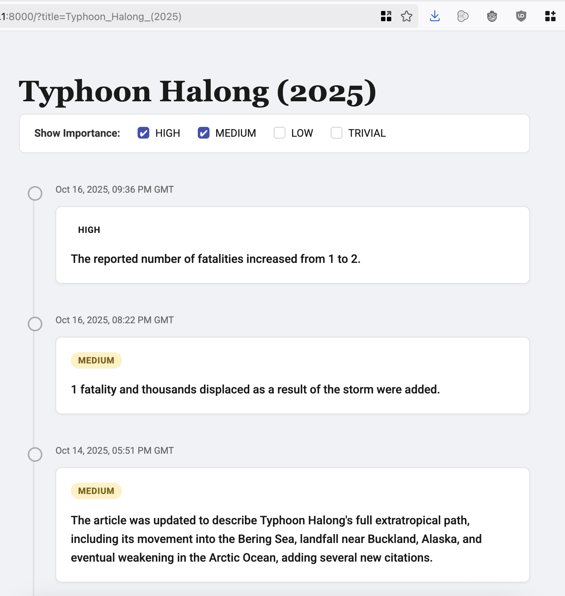

# Wikipedia News Updater

This project experiments with generating live, event-style updates from Wikipedia edits, similar to the breaking news tickers used by outlets like The New York Times or Al Jazeera. It continuously compares article revisions over a one-hour window, feeds the diff into a large language model, and produces a short ranked summary of what changed and how important the update is. The goal is to surface meaningful developments as they happen, with eventual support for real-time push notifications or alerts.

Yes, Wikipedia has a version history but often it's full of small syntatic edits or formatting changes that create a lot of noise.

This was a project for [Hacktoberfest Hackathon 2025 - San Francisco](https://www.meetup.com/digitaloceansanfrancisco/events/311197949/).

This project won third place over all!

## UI Inspiration

- [New York Times: Hurricane Melissa Jamaica Landfall](https://www.nytimes.com/live/2025/10/28/weather/hurricane-melissa-jamaica-landfall)
- [Al Jazeera: Hurricane Melissa Live](https://www.aljazeera.com/news/liveblog/2025/10/28/hurricane-melissa-live-category-5-storm-nears-jamaica-strongest-this-year)
- [GitHub status page incident](https://www.githubstatus.com/incidents/k7bhmjkblcwp)

# Screenshot

# Local Setup

1. Create a `.env` file with `OPENROUTER_API_KEY=<your-openrouter-api-key>`

2. Run `uv run uvicorn api:app --reload --workers=2`

3. Visit: http://127.0.0.1:8000/?title=Typhoon_Halong_(2025) (or similar)

# Technical Details

This was hacked together in just a few hours so it's really rough around the edges.
- It stores the data it collects in `data/` instead of a proper DB.
- It's all just one index.html file for the frontend.
- There is a chance of race conditions because it doesn't kick off a background job.

This was fun to build
